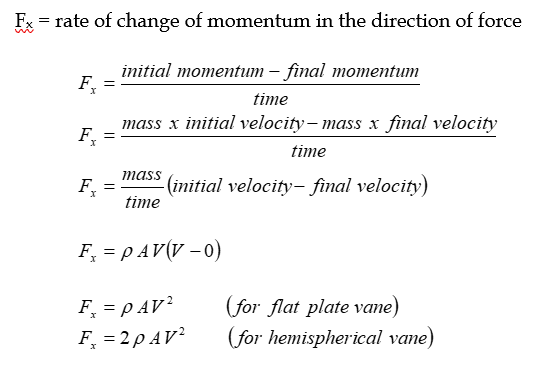

This folder has 

### Aim: 

To determine the drag coefficient.

### THEORY

In fluid flow there is a transfer of momentum which gives rise to a tangential stress or drag on a smooth surface that is oriented parallel to the flow direction. This is called skin drag. In addition to this, additional friction losses occur because of acceleration & deceleration of fluid. The accelerative effects occur when the fluid changes its path to pass around a solid body set in the flow path. This phenomenon is known as form drag.

Under gravitational field, the motion of a particle through a fluid is due to the density difference between the particle and the fluid. Consider the motion of a spherical particle of diameter dp density through a fluid of viscosity and density

Various forces acting on the particle are:

(1)	External force Fg
(2)	Buoyancy force FB  
(3)	Drag force FD  

Equation for motion of particle through fluid:

 

Where m is mass of the sphere particle, Ap is projected area, u is particle velocity and CD is dimensionless drag coefficient. 

Substituting the forces from equation (2) to (4) equation (1) and we get:

At terminal velocity condition (du/dt = 0, u = ut) and for spherical partical the equation reduces to.

Motion of spherical particle through fluids:

Substitute the value of m and Ap in eqution (6) and we get:

Particle Reynolds Number is:

Plot of CD vs Rep on log log scale

For Rep <= 1

For 1000 (Rep < 200,000) CD = 0.44 (Newton’s Law Region)                                                                                                         

### EXPERIMENTAL SET UP

The present set-up consists of three glass tube fitted vertically on a wall structure. Mass are given on the walls of the glass tubes. Fluorescent tube light mounted on the backboard. A valve system is provided at the bottom of each tube for removal of particle. 

Spherical balls are provided as accessories.

### CALCULATION TABLE

### PROCEDURE

1. Close all the valves V1-V6.
2. Fill the three tubes with three different liquid.
3. Select the balls of different size.
4. Note down their diameter.
5. Switch ON the power supply.
6. Now drop one ball in one of the column.
7. Note the distance traveled by ball and time taken by it.
8. Repeat the experiment for different column.
9. Repeat the experiment for different balls.

### RESULTS

Drag coefficient = 

### PRECAUTIONS

1. During the experiment upper valve should be open and bottom valve should be close.
2.	If the equipment is not in use more than one month drain the fluids and clean the columns.
3.	Collect the balls by close the upper valve and open the bottom valve for reuse.

